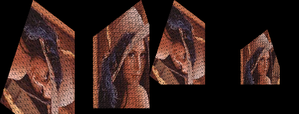
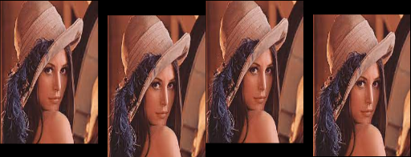
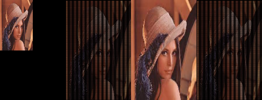

# Image-Transformation

A script that takes an image I along with a linear transformation T as inputs and generate the transformed image T(I).

1. By mapping each sample/pixel of the input image to the output image using T.

2. By mapping each sample of the output image to the input image I using  T-1 and using bilinear interpolation to compute the sample value.

These above tasks are done twice:

First time discard the samples that go outside the target image boundary.

Second time show the complete transformed image.

The sequence of output images is as follows:

1. transform

2. inverse_transform

3. complete_transform

4. complete_inverse_transform

# Rotation

# Translation

# Scaling

Demo: https://www.youtube.com/watch?v=f1mBwO7kBXw
